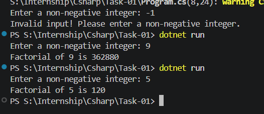

# 🧮 CS-01: Factorial Calculator (Console Application)

## 🎯 Objective

Develop a C# console application to compute the factorial of a given number using basic data types, control structures, and methods.

---

## 📌 Problem Statement

* Read an integer input from the user
* Validate the input (must be a non-negative integer)
* Calculate the factorial using a loop
* Display the result in the console

---

## 🧠 Approach

### 1. Input Handling

* Use `Console.ReadLine()` to read user input
* Input is received as a **string**

---

### 2. Input Validation

* Use `int.TryParse()` to safely convert string → integer
* Ensure:

  * Input is numeric
  * Number ≥ 0

If invalid:

* Display error message
* Terminate program

---

### 3. Factorial Logic

* Initialize:

  ```csharp
  long factorial = 1;
  ```

* Use a `for` loop:

  * Iterate from `1` to `n`
  * Multiply each number

* Core operation:

  ```csharp
  factorial *= i;
  ```

---

### 4. Output

* Display result using string interpolation:



---


## ⚠️ Edge Cases Handled

* Negative input → Invalid
* Non-numeric input → Prevented using `TryParse`
* Input = 0 → Output = 1

---

## 📊 Complexity

* Time Complexity: **O(n)**
* Space Complexity: **O(1)**

---

## 💡 Key Concepts Used

* Console Input/Output (`Console.ReadLine`, `Console.WriteLine`)
* Data Types (`int`, `long`, `string`)
* Conditional Statements (`if`)
* Looping (`for`)
* Operators (`*=` , `||`, `!`)
* Input Validation (`TryParse`)

---


