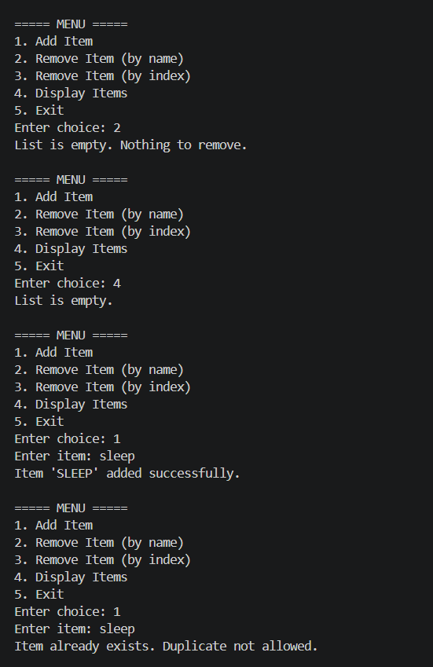
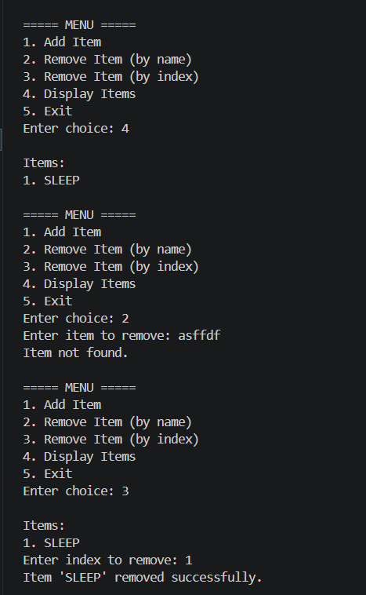

# 📌 Basic Collections and String Manipulation (C#)

## 🎯 Objective

Develop a console-based application to manage a collection of strings using `List<string>`.
The program allows users to add, remove, and display items while ensuring proper input handling and data consistency.

---

## 📋 Requirements

* Use `List<string>` for storing items
* Implement add, remove, and display functionalities
* Process user input using string methods like `Trim()` and `ToUpper()`
* Ensure input validation and error handling

---

## 🛠️ Implementation

### 🔹 Data Storage

* Used `List<string>` as a dynamic collection to store items
* Supports automatic resizing and efficient operations

### 🔹 Menu-Driven System

* Implemented an infinite loop (`while(true)`) for continuous interaction
* Used `switch` statement for handling user choices

### 🔹 Add Operation

* Takes user input
* Cleans input using `Trim()`
* Standardizes using `ToUpper()`
* Prevents empty and duplicate entries

### 🔹 Remove Operation

* Supports:

  * Removal by value
  * Removal by index
* Validates input before performing operations

### 🔹 Display Operation

* Iterates through list using loop
* Displays items with index for better usability

### 🔹 Input Handling

* Used `string.IsNullOrWhiteSpace()` for validation
* Used `int.TryParse()` for safe numeric conversion

### 🔹 Data Consistency

* Maintained uniform format (uppercase) for all stored values
* Ensures reliable comparison during add/remove operations

---

## ⚙️ Features

* Add items with validation
* Remove items by name and index
* Display items in ordered format
* Duplicate prevention
* Robust input handling
* User-friendly console interaction

---

## 📸 Output

---

---

## 📚 Learnings

* Understanding and usage of `List<string>`
* Importance of input normalization (`Trim()`, `ToUpper()`)
* Implementing menu-driven console applications
* Writing defensive code with proper validations
* Structuring code using modular functions

---
