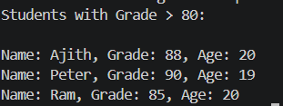

# 📌 CS-04: Working with Collections and LINQ

## 🎯 Objective

Develop a console-based application to manage student data using `List<Student>` and perform querying operations using LINQ such as filtering and sorting.

---

## 📋 Requirements

* Define a `Student` class with properties: `Name`, `Grade`, and `Age`
* Populate a `List<Student>` with sample data
* Use LINQ to filter students based on grade threshold
* Sort the filtered results
* Display the final output

---

## 🛠️ Implementation

### 🔹 Data Model

* Created a `Student` class with properties:

  * `Name`
  * `Grade`
  * `Age`
* Used auto-properties for clean and simple structure

---

### 🔹 Data Storage

* Used `List<Student>` to store multiple student objects
* Initialized list with sample data using object initializer syntax

---

### 🔹 LINQ Query

* Applied `Where()` to filter students with grade above threshold
* Applied `OrderBy()` to sort filtered results by name
* Used method chaining for clean query structure

---

### 🔹 Execution Handling

* Used `.ToList()` to execute the query and store results
* Avoided repeated execution of LINQ queries

---

### 🔹 Output Display

* Iterated through filtered list using `foreach`
* Displayed student details in a formatted manner

---

## ⚙️ Features

* Object-based data modeling
* LINQ-based filtering and sorting
* Clean and readable query structure
* Efficient data processing using deferred execution
* Console-based output formatting

---

## 📸 Output

---

## 📚 Learnings

* Usage of `List<T>` with custom objects
* Introduction to LINQ for querying collections
* Understanding `Where()` and `OrderBy()`
* Concept of `IEnumerable` and deferred execution
* Importance of `.ToList()` for execution and data stability

---

