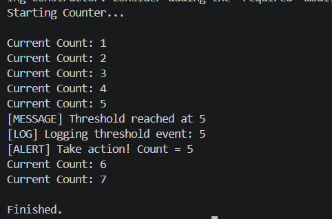

# CS06 – Delegates, Events, and Basic Event Handling

---

## 📌 Objective

To understand and implement delegates and events in C# by building a console-based event-driven application.

---

## 📋 Requirements

* Define a delegate and an event that fires when a counter reaches a specific value
* Create multiple event handler methods
* Increment a counter in a loop
* Raise an event when threshold is reached
* Demonstrate loose coupling between producer and consumers

---

## 🛠️ Implementation

### 1. Delegate

* Created a custom delegate `ThresholdReachedHandler`
* Defines method signature for event handlers

### 2. Event

* Declared event `OnThresholdReached` using delegate
* Event is triggered when counter reaches threshold

### 3. Counter Class (Producer)

* Maintains count and threshold
* Increments value in loop
* Raises event when threshold is met

### 4. Event Handlers (Consumers)

* ShowMessage → displays message
* LogMessage → logs event
* AlertUser → alerts user

### 5. Main Flow

* Create counter object
* Subscribe multiple handlers
* Increment counter in loop
* Event gets triggered at threshold

---

## ▶️ Output

---

## 💡 Learnings

* Delegates allow storing method references
* Events provide controlled access to delegates
* Multiple handlers can respond to a single event
* Events help decouple logic between components
* Safe invocation using `?.Invoke()` prevents runtime errors

