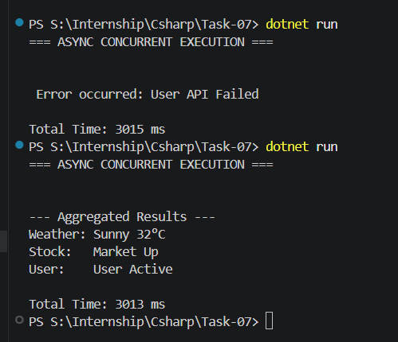

# 🚀 C# Async Concurrent Operations Console App

---

## 📌 Objective

To develop a C# console application that performs multiple asynchronous operations concurrently using `async` and `await`, aggregates the results, and handles exceptions effectively.

---

## 📋 Requirements

* Use `async` and `await` for non-blocking operations
* Simulate API calls using `Task.Delay`
* Execute multiple tasks concurrently
* Aggregate results after completion
* Handle exceptions during async execution

---

## ⚙️ Implementation

### 1. Asynchronous Methods

* Created multiple async methods:

  * `GetWeatherAsync()`
  * `GetStockAsync()`
  * `GetUserAsync()`

* Each method:

  * Simulates delay using `Task.Delay`
  * Returns a string result
  * One method includes simulated exception handling

---

### 2. Concurrent Execution

* Tasks are started without awaiting immediately:

```
var weatherTask = GetWeatherAsync();
var stockTask = GetStockAsync();
var userTask = GetUserAsync();
```

* All tasks are awaited together using:

```
await Task.WhenAll(weatherTask, stockTask, userTask);
```

---

### 3. Result Aggregation

* Results are collected into an array:

```
var results = await Task.WhenAll(...);
```

* Output is displayed in a structured format

---

### 4. Exception Handling

* Wrapped execution inside `try-catch`
* Handles failures from any async task

---

### 5. Performance Measurement

* Used `Stopwatch` to measure execution time
* Demonstrates improvement using concurrent execution

---

## 📊 Output



---

## ⚡ Key Concepts Demonstrated

* Asynchronous programming using `async` and `await`
* Non-blocking execution
* Task-based programming (`Task`, `Task<T>`)
* Concurrent execution using `Task.WhenAll`
* Exception handling in async workflows
* Efficient thread usage via ThreadPool

---

## 🧠 Learnings

* Async improves performance for I/O-bound operations by avoiding thread blocking
* Sequential async execution increases total execution time
* `Task.WhenAll` enables concurrency by overlapping waiting time
* Async does not guarantee parallel execution
* ThreadPool efficiently manages execution of async continuations

---
