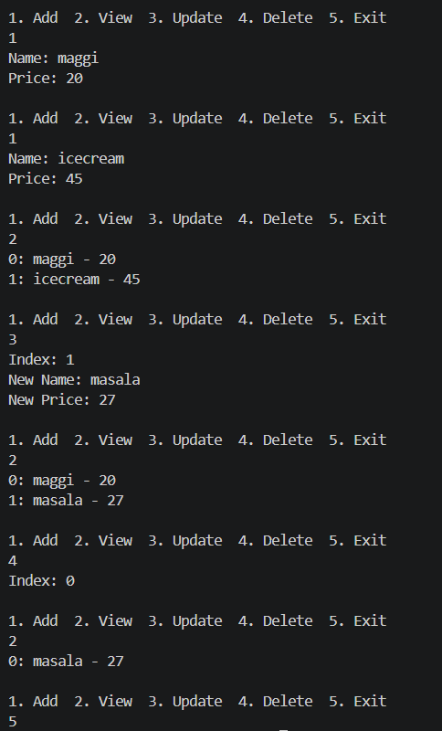

# 📦 Task-08: Generic In-Memory Repository (C#)

## 🎯 Objective

Implement a generic in-memory repository to perform CRUD operations using interfaces and generics.

---

## 📋 Requirements

* Define an interface (`IRepository<T>`) with CRUD methods
* Create a generic class implementing the interface
* Use type constraint (`where T : class`)
* Demonstrate usage using a sample entity (`Product`) with a console UI

---

## 🛠️ Implementation

### 🔹 Interface

* Created a generic interface `IRepository<T>`
* Defined basic CRUD operations:

  * Add
  * GetAll
  * Update
  * Delete

### 🔹 Generic Repository

* Implemented `Repository<T>` class
* Used `List<T>` as in-memory storage
* Applied type constraint: `where T : class`
* Performed operations using index-based access

### 🔹 Entity

* Created a simple `Product` class
* Properties:

  * Name
  * Price

### 🔹 Console UI

* Menu-driven program to:

  * Add product
  * View all products
  * Update product
  * Delete product

---

## ⚠️ Notes / Limitations

* No null checks for user input
* No validation for invalid formats
* Assumes user enters correct index
* Focus is on understanding **interface + generics concept**

---

## 📸 Output

---

## 🧠 Learnings

* Understood how interfaces define contracts
* Learned how generics enable code reusability
* Implemented a reusable repository pattern
* Understood basic CRUD operations in memory
* Gained clarity on loose coupling using interfaces

---
