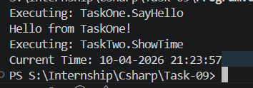

# 📌 Task: Custom Attribute & Reflection Runner

## 🎯 Objective

To build an application that identifies and executes specific methods dynamically using custom attributes and reflection.

This task focuses on understanding how modern frameworks internally discover and execute logic based on metadata.

---

## 📋 Requirements

* Define a custom attribute `[Runnable]`
* Apply the attribute to selected methods across multiple classes
* Scan the assembly at runtime
* Identify only the methods marked with `[Runnable]`
* Dynamically execute those methods

---

## 🧠 Key Concepts

### 🔹 Attribute

* Acts as metadata attached to code elements
* Does not execute logic by itself
* Used to mark methods for special processing

### 🔹 Reflection

* Allows inspection of code at runtime
* Enables access to types, methods, and attributes dynamically

### 🔹 Dynamic Execution

* Methods are executed without direct calls
* Invocation happens based on runtime discovery

---

## ⚙️ Implementation Overview

### Step 1: Attribute Definition

A custom attribute is created to mark methods that need to be executed.

### Step 2: Method Decoration

Multiple classes are created, where only selected methods are marked using the custom attribute.

### Step 3: Assembly Scanning

The application retrieves the current assembly and extracts all available types.

### Step 4: Method Inspection

Each type is inspected to identify its methods.

### Step 5: Attribute Filtering

Only methods containing the custom attribute are selected.

### Step 6: Dynamic Execution

Instances of the respective classes are created dynamically, and the identified methods are executed.

---

## 🔄 Execution Flow

Application Start
↓
Load Assembly
↓
Fetch All Types
↓
Iterate Through Methods
↓
Check for `[Runnable]`
↓
Create Instance
↓
Invoke Method
↓
Display Output

---

## 🧪 Output

* Only methods marked with `[Runnable]` are executed
* Non-decorated methods are ignored
* Output confirms dynamic discovery and execution

---

## ⚠️ Assumptions & Limitations

* Methods do not take parameters
* Classes contain a default constructor
* Exception handling is not implemented
* Focus is purely on demonstrating attribute and reflection usage

---

## 🧠 Learnings

* Understood the role of attributes as metadata markers
* Learned how reflection enables runtime inspection of code
* Implemented dynamic method execution
* Gained insight into how frameworks like ASP.NET internally process attributes

---

## 🚀 Real-World Relevance

* API authorization systems (e.g., `[Authorize]`)
* Test frameworks (NUnit, xUnit)
* Dependency Injection systems
* Plugin-based architectures

---

## 📌 Key Takeaways

* Attributes define *what* should be processed
* Reflection determines *where* they exist
* Runtime logic decides *how* they are executed

---
